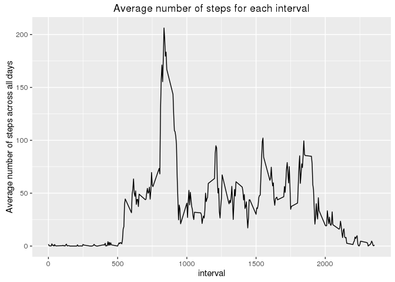
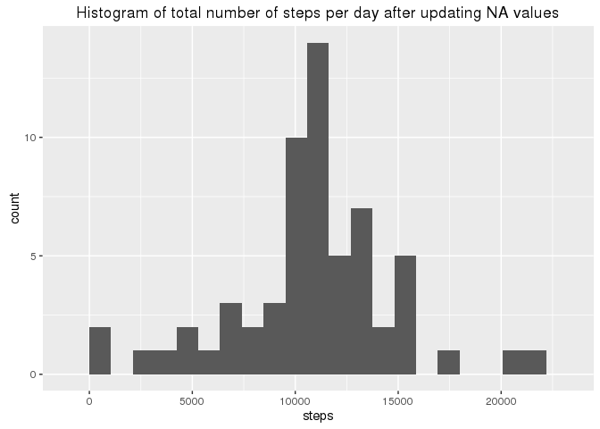
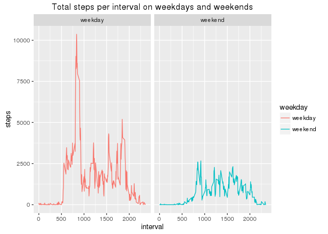

# Reproducible Research: Peer Assessment 1

## Loading and preprocessing the data


```r
unzip(zipfile='activity.zip')
activity <- read.csv('activity.csv')
```

Summary of the csv file:


```r
summary(activity)
```

```
##      steps                date          interval     
##  Min.   :  0.00   2012-10-01:  288   Min.   :   0.0  
##  1st Qu.:  0.00   2012-10-02:  288   1st Qu.: 588.8  
##  Median :  0.00   2012-10-03:  288   Median :1177.5  
##  Mean   : 37.38   2012-10-04:  288   Mean   :1177.5  
##  3rd Qu.: 12.00   2012-10-05:  288   3rd Qu.:1766.2  
##  Max.   :806.00   2012-10-06:  288   Max.   :2355.0  
##  NA's   :2304     (Other)   :15840
```

## What is mean total number of steps taken per day?

Total number of steps taken per day:

```r
aggregated_steps <- aggregate(steps ~ date, activity, sum, rm.na = TRUE)
```

plot a histogram:

```r
library(ggplot2)
g <- ggplot(aggregated_steps,aes(x=steps))+geom_histogram(stat="bin",bins=20)+ggtitle("Histogram of total number of steps taken each day")
print(g)
```

<!-- -->

Mean and median of the number of steps:

```r
mean(aggregated_steps$steps,na.rm=TRUE)
```

```
## [1] 10767.19
```

```r
median(aggregated_steps$steps,na.rm=TRUE)
```

```
## [1] 10766
```


## What is the average daily activity pattern?

Time series:

```r
average_steps <- aggregate(steps ~ interval, activity, mean, rm.na = TRUE)
g <- ggplot(average_steps, aes(x=interval,y=steps))
g <- g + ggtitle("Average number of steps for each interval")
g <- g + ylab('Average number of steps across all days')
g <- g +geom_line()
print(g)
```

<!-- -->

Maximum number of average steps:

```r
average_steps[order(average_steps$steps,decreasing = TRUE),][1,]
```

```
##     interval    steps
## 104      835 206.1698
```


## Imputing missing values

Number of rows that contain NA:

```r
nrow(activity[is.na(activity),])
```

```
## [1] 2304
```
 
Compensate NA values by the mean of that interval:

```r
intervals <-  unique(activity[,3])
for (i in 1:length(intervals)){
   v <- average_steps[average_steps$interval == intervals[i],]$steps
   activity[is.na(activity$steps) & activity$interval == intervals[i],]$steps <- v
  
}
```

New histogram:

```r
aggregated_steps <- aggregate(steps ~ date, activity, sum, rm.na = TRUE)
g <- ggplot(aggregated_steps,aes(x=steps))+geom_histogram(stat="bin",bins=20)
g <- g+ggtitle("Histogram of total number of steps per day after updating NA values")
print(g) 
```

<!-- -->

```r
mean(aggregated_steps$steps,na.rm=TRUE)
```

```
## [1] 10767.19
```

```r
median(aggregated_steps$steps,na.rm=TRUE)
```

```
## [1] 10767.19
```


## Are there differences in activity patterns between weekdays and weekends?

```r
weekday_factor <- function(date) {
    if (weekdays(as.Date(date,'%Y-%m-%d')) %in% c("Saturday", "Sunday")) {
        "weekend"
    } else {
        "weekday"
    }
}
activity$weekday <- sapply(activity$date,weekday_factor)
sum_steps_weekdays <- aggregate(steps ~ interval + weekday, activity, sum, rm.na = TRUE)
g <- ggplot(sum_steps_weekdays, aes(x=interval,y=steps,color=weekday))+geom_line()+facet_wrap(~weekday)
g <- g+ggtitle("Total steps per interval on weekdays and weekends")
print(g)
```

<!-- -->
